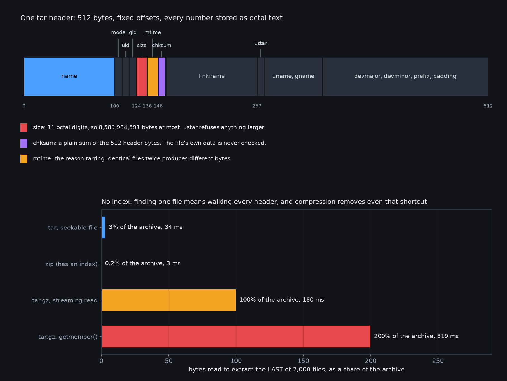

# tar-has-no-index

The code behind the article. Every claim was checked against GNU tar 1.35 and Python 3.14's
`tarfile`.

- `handtar.py` builds a two-file tar from the POSIX ustar spec with `struct`, which GNU tar
  then lists and extracts
- `count_reads.py`, `count_gz.py`, `count_stream.py` count the bytes and seeks each approach
  needs to extract the last of 2,000 files
- `reproduce.sh` reruns the remaining claims in order: the header-only checksum, the 8 GiB
  ustar limit, non-reproducible archives and the flags that fix them, and append semantics

| extracting the last of 2,000 files | bytes read | time |
|---|---|---|
| tar, seekable file | 3.0% | 34 ms |
| zip, which has an index | 0.2% | 3 ms |
| tar.gz, streaming read | 100% | 180 ms |
| tar.gz, Python `getmember()` | 200% | 319 ms |

MIT licensed.
